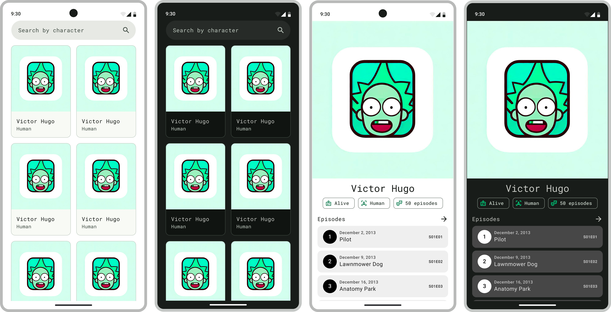

# rick-n-morty
Study app that displays the characters and episodes of Rick and Morty using Jetpack Compose.

## TODOS ✅
- [x] CI Pipeline using Github Actions
  - [x] Kover (https://github.com/Kotlin/kotlinx-kover)
  - [x] Detekt (https://detekt.dev/)
  - [x] Ktlint (https://pinterest.github.io/ktlint)
  - [x] Unit Tests
  - [x] Sonar (https://sonarcloud.io/project/overview?id=VictorHVS_rick-n-morty)
  - [x] CodeCov (https://codecov.io/gh/VictorHVS/rick-n-morty)
- [x] UX/UI using [Figma](https://www.figma.com/file/quqLCyNbZniCM58U78lQ5g/%5BM3%5D-RNM-UNIVERSE-PROJECT?type=design&node-id=54313-25258&mode=design&t=VYaJlO1ELop5IFBA-4), Material 3 and Generated images using Bing Image
- [x] Hilt Setup
- [x] Retrofit Setup
- [ ] Room Setup
- [x] Paging3 + Remote Mediator
- [ ] Compose Navigation
- [ ] Deep link
- [x] Home Screen with Character List
  - [x] Datasource
  - [x] Repository
  - [x] ViewModel
  - [x] UI using UDF Pattern (https://developer.android.com/jetpack/compose/architecture#udf)
- [ ] Character Detail Screen
- [ ] CD Pipeline using Github Actions

## Built With 🛠
- [Kotlin](https://kotlinlang.org/) - First class and official programming language for Android development.
- [Jetpack Compose](https://developer.android.com/jetpack/compose) - Jetpack Compose is Android’s modern toolkit for building native UI.
- [Android Architecture Components](https://developer.android.com/topic/libraries/architecture) - Collection of libraries that help you design robust, testable, and maintainable apps.
- [Jetpack Compose Navigation](https://developer.android.com/jetpack/compose/navigation) - Navigation refers to the interactions that allow users to navigate across, into, and back out from the different pieces of content within your app
- [Material 3](https://developer.android.com/reference/kotlin/androidx/compose/material3/package-summary.html) - Modular and customizable Material Design UI components for Android.
- [Paging 3](https://developer.android.com/topic/libraries/architecture/paging/v3-overview) - The Paging library helps you load and display pages of data from a larger dataset from local storage or over network.

## API 🖥️
FREE Rick and Morty API: https://rickandmortyapi.com/documentation

## Design 🎨
Figma Design Kit: https://www.figma.com/file/quqLCyNbZniCM58U78lQ5g/%5BM3%5D-RNM-UNIVERSE-PROJECT?type=design&node-id=54313-25258&mode=design&t=VYaJlO1ELop5IFBA-4

### Screens (Dark and Light mode)
<p align="center"> 
    
   Character List & Search
</p>

<p align="center"> 
    
   Character Detail
</p>

## Pre-Commit Hooks 🎣
1. create a file named `pre-commit` in `.git/hooks/`
2. add the following code to the file
3. make the file executable using `chmod +x .git/hooks/pre-commit`
4. commit your changes
5. if any of the checks fail, the commit will be aborted
6. if you want to commit anyway, use `git commit --no-verify`
``` bash
#!/usr/bin/env bash
echo "Running detekt check..."
OUTPUT="/tmp/detekt-$(date +%s)"
./gradlew ktlintFormat > $OUTPUT
./gradlew detekt > $OUTPUT
EXIT_CODE=$?
if [ $EXIT_CODE -ne 0 ]; then
  cat $OUTPUT
  rm $OUTPUT
  echo "***********************************************"
  echo "                 detekt failed                 "
  echo " Please fix the above issues before committing "
  echo "***********************************************"
  exit $EXIT_CODE
fi
rm $OUTPUT
```

## License 👮‍♂️
```
Copyright 2022 The Android Open Source Project

Licensed under the Apache License, Version 2.0 (the "License");
you may not use this file except in compliance with the License.
You may obtain a copy of the License at

    https://www.apache.org/licenses/LICENSE-2.0

Unless required by applicable law or agreed to in writing, software
distributed under the License is distributed on an "AS IS" BASIS,
WITHOUT WARRANTIES OR CONDITIONS OF ANY KIND, either express or implied.
See the License for the specific language governing permissions and
limitations under the License.
```
